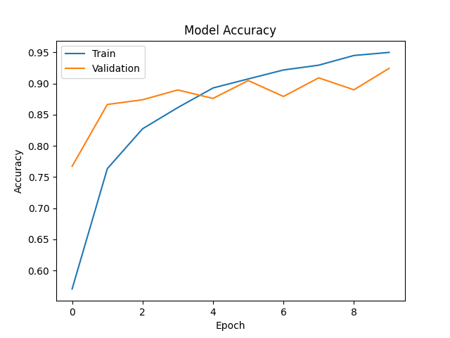
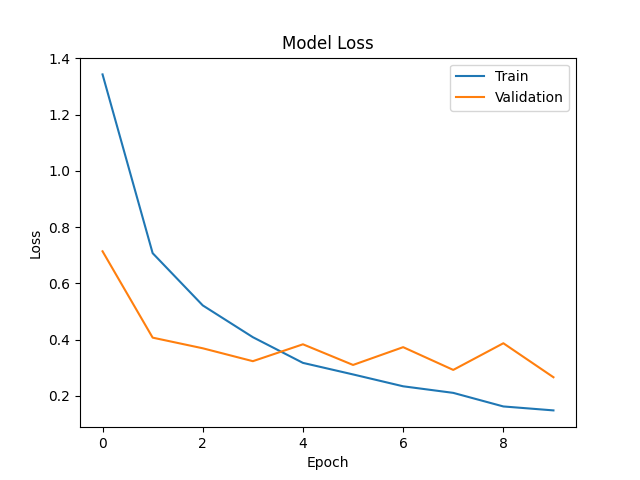
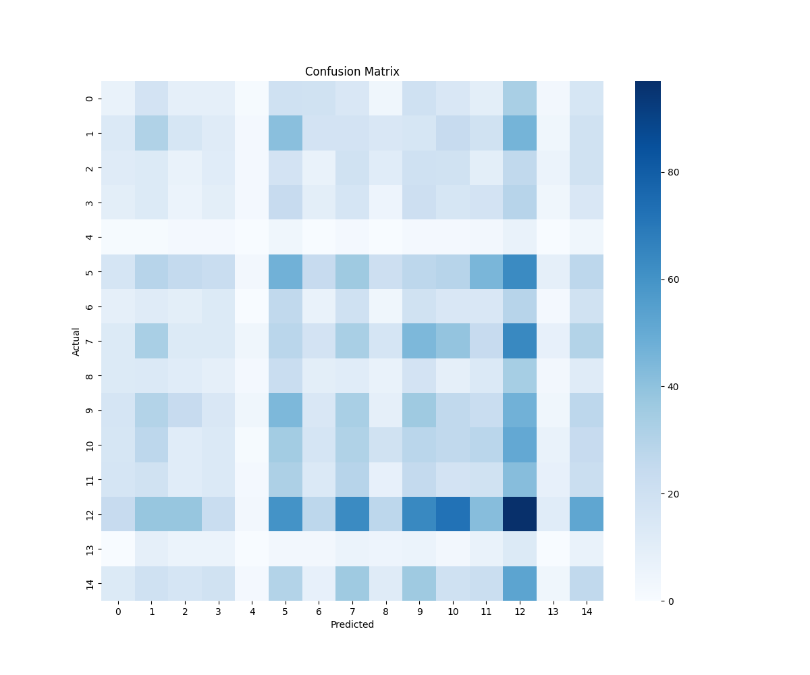

# 🌿 Plant Disease Detection using Deep Learning


A deep learning project that detects **plant diseases from leaf images** using Convolutional Neural Networks and Transfer Learning.

# 📌 Project Overview

Plant diseases cause significant losses in agriculture every year. Early detection can help farmers prevent crop damage and improve yield.

This project uses **Deep Learning and Computer Vision** to automatically detect plant diseases from leaf images.

The system analyzes an image of a plant leaf and predicts:

✔ The plant type  
✔ The disease affecting the plant  
✔ Confidence score of the prediction  


# 📂 Dataset

The model is trained on a subset of the **PlantVillage dataset**.

Dataset features:
- **15 plant disease classes**
- Thousands of labeled leaf images
- Images captured under controlled conditions

### Example Classes

- Pepper Bell Bacterial Spot
- Pepper Bell Healthy
- Potato Early Blight
- Potato Late Blight
- Tomato Bacterial Spot
- Tomato Early Blight
- Tomato Late Blight
- Tomato Leaf Mold
- Tomato Septoria Leaf Spot
- Tomato Spider Mites
- Tomato Target Spot
- Tomato Mosaic Virus
- Tomato Yellow Leaf Curl Virus
- Tomato Healthy

# 🧠 Model Architecture
The model uses **Transfer Learning with EfficientNet** to achieve high accuracy.
### Model Details
| Component | Description |
|----------|-------------|
| Base Model | EfficientNet |
| Input Size | 224 × 224 |
| Framework | TensorFlow / Keras |
| Output Layer | Softmax (15 Classes) |
| Training Platform | Google Colab |

# 📊 Model Performance
After training the model, the following results were achieved.
| Metric | Value |
|------|------|
| Training Accuracy | ~94% |
| Validation Accuracy | ~92% |
| Epochs | 10 |

# 📈 Training Graphs
### Accuracy Curve



### Loss Curve


# 📊 Confusion Matrix
The confusion matrix helps visualize how well the model performs across different disease classes.



# 🔍 Example Prediction
Example output from the trained model:
Predicted Disease: Pepper__bell___Bacterial_spot
Confidence: 99.0 %


The model successfully detects plant diseases from leaf images with high confidence.

# ⚙️ Technologies Used

- Python
- TensorFlow
- Keras
- NumPy
- Matplotlib
- Scikit-learn
- Google Colab


# Plant Disease Detection Project

## Project Structure

```
plant-disease-detection/
├── data/
│   └── PlantVillage_dataset/
├── results/
│   ├── accuracy_curve.png
│   ├── loss_curve.png
│   └── confusion_matrix.png
├── notebooks/
│   └── training_notebook.ipynb
├── predict.py
├── train_model.py
└── README.md
```

# 🚀 Future Improvements
Possible enhancements for the project:

- Deploy the model using **Streamlit Web App**
- Build a **mobile app for farmers**
- Train on **larger real-world datasets**
- Add **disease treatment recommendations**

# 👩‍💻 Author
**Komal Kumari**

⭐ If you found this project useful, consider giving it a star!
